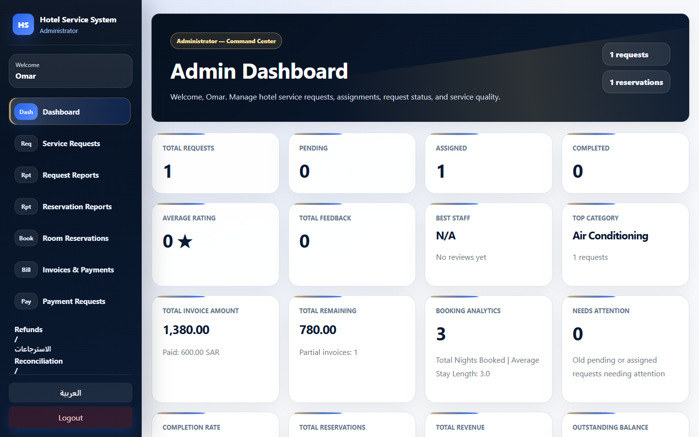
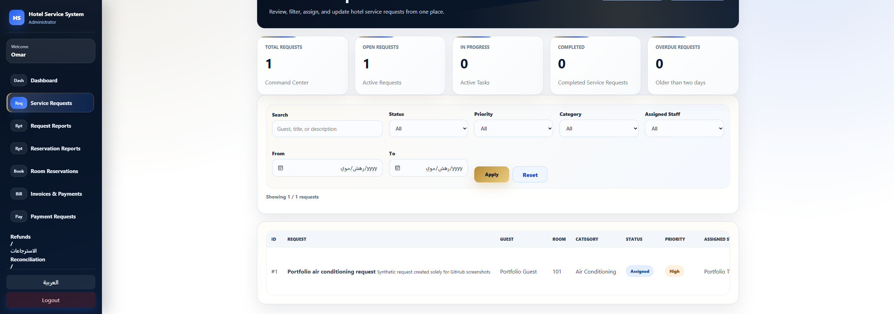
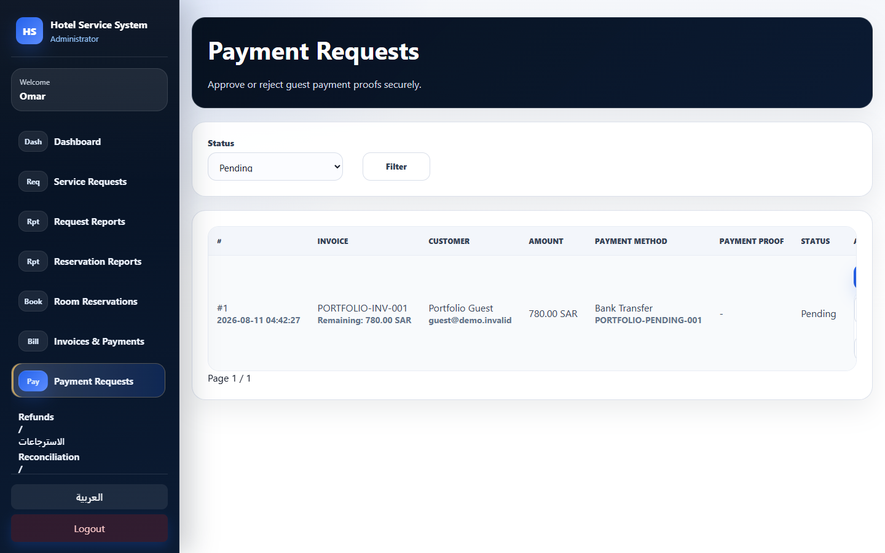
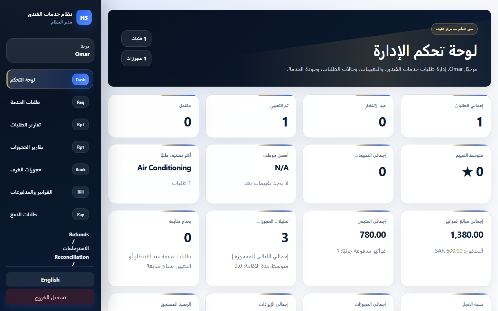
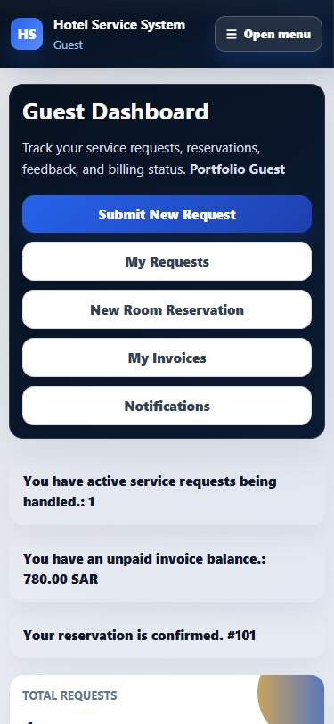

# Hotel Service System

A bilingual and responsive hotel operations system designed to manage service requests, reservations, invoicing, payment-review workflows, staff assignments, and guest services.

> Portfolio showcase only. The source code and operational configuration are maintained in a private repository.

## Project Overview

Hotel Service System is a full-stack web application built to organize hotel operations through dedicated interfaces for administrators, receptionists, staff members, and guests.

The system supports English and Arabic interfaces, including LTR and RTL layouts, with responsive behavior for desktop and mobile devices.

## Key Features

- Role-based dashboards and authorization
- Hotel service-request creation and tracking
- Request assignment, priority, status, age, and SLA indicators
- Room reservations and availability safeguards
- Invoice and payment-request management
- Manager and receptionist payment-review workflows
- Guest notifications and feedback
- Operational reports and CSV exports
- English and Arabic interfaces
- Responsive desktop and mobile layouts

## Technology Stack

- PHP 8
- MariaDB / MySQL
- HTML5
- CSS3
- Vanilla JavaScript
- Apache / XAMPP
- GitHub Actions

## Security Highlights

- Role-based access control
- Ownership validation
- CSRF protection
- Prepared database statements
- Transactional financial operations
- Hardened session handling
- Authentication rate limiting
- Protected file uploads
- Secret scanning
- Security regression testing
- Financial and migration integrity checks

The project uses offline sandbox and manual payment workflows only. It does not process live payments or store payment-card data.

## Interface Showcase

### Administrator Dashboard

### Service Requests

### Payment Requests

### Arabic RTL Interface

### Mobile Guest Experience

  

## Quality Assurance

The private development repository includes automated validation for:

- PHP syntax
- Authentication and authorization
- Database migrations
- Service and reservation workflows
- Payment and refund integrity
- Security regression
- Responsive layouts
- Arabic RTL and English LTR interfaces
- Clean-release packaging
- Sensitive-file detection

The final GitHub Actions workflow completed successfully.

## Project Status

- Version: `v1.7.3`
- Status: Completed portfolio project
- Languages: English and Arabic
- Platforms: Desktop and mobile web
- Source code: Private
- Live payment processing: Not enabled
- Public production deployment: Not included

## Author

**Omar Almotairi**

- GitHub: [omaralmotiriy](https://github.com/omaralmotiriy)
- Cybersecurity graduate
- Interested in secure software development, IT, and web application security

## Notice

This public repository is a visual portfolio showcase. It does not contain source code, credentials, database exports, private configuration, operational data, or customer information.

© 2026 Omar Almotairi. All rights reserved.
